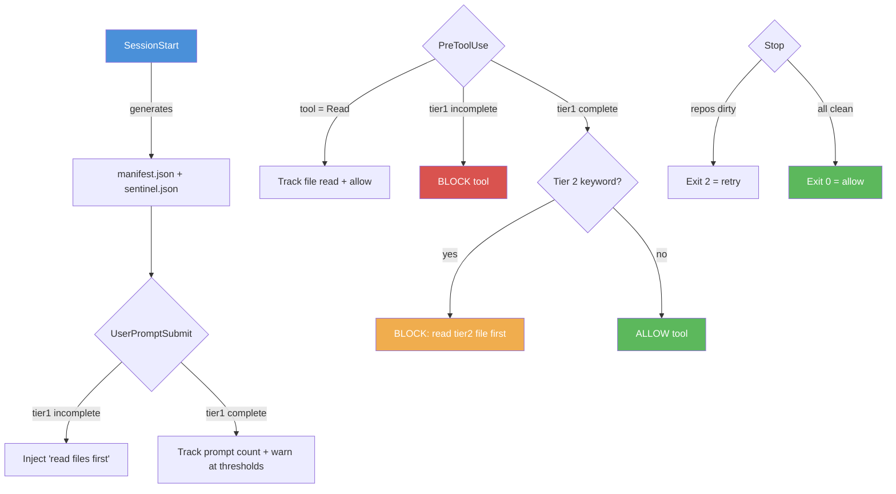

# Architecture Overview

Four hook points work together:

**Manifest** (`manifest.json`) — lists all tier1/tier2 files with paths, sizes,
and trigger keywords. Generated fresh each session.

**Sentinel** (`startup-complete-{session}.json`) — tracks which files the agent has
read, whether tier1 is complete, and whether cross-check has run. Session-scoped
to prevent collisions between concurrent or resumed sessions.
