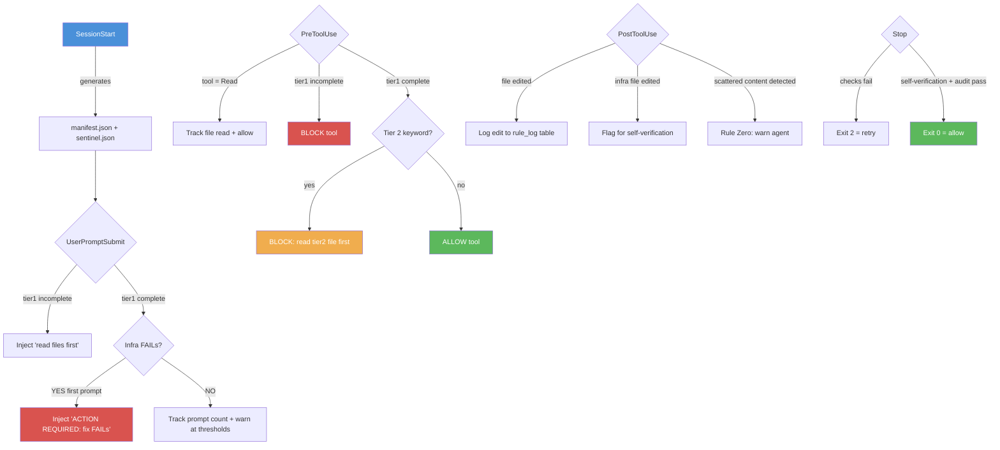

# Architecture Overview

Five hook points work together:

**Manifest** (`manifest.json`) — lists all tier1/tier2 files with paths, sizes,
and trigger keywords. Generated fresh each session.

**Sentinel** (`startup-complete-{session}.json`) — tracks which files the agent has
read, whether tier1 is complete, and whether cross-check has run. When cross-check
detects persistent drift, it generates `write_back_suggestions` stored in the
sentinel — these propose manifest updates (e.g., corrected counts or paths) that
can be applied to keep the config in sync with reality. Session-scoped
to prevent collisions between concurrent or resumed sessions.

**PostToolUse — Rule Zero & Edit Tracking** (`on_edit.py`) — fires after every
tool use. Tracks file edits in the `rule_log` table for audit trail. When an
infrastructure file is edited, it flags the session for self-verification at
exit. Rule Zero enforcement scans edited files for scattered content (rules,
facts, or decisions embedded outside the canonical store) and warns the agent
to consolidate.

**Audit Runner** (`audit.py`) — standalone audit runner that validates project
invariants (rule counts, file integrity, config consistency). Integrated with
the stop hook at Level 4: `require_audit_pass` runs the audit checks before
allowing session exit. Can also be invoked manually for on-demand validation.

**Stop Hook — Self-Verification** (`on_stop.py`) — at Level 4, the stop hook
goes beyond clean-repo checks. `require_self_verification` blocks exit if
infrastructure files were edited after the last validation pass, forcing the
agent to re-verify before closing. Session continuity is enforced by requiring
a session summary and checking for open backlog items.
