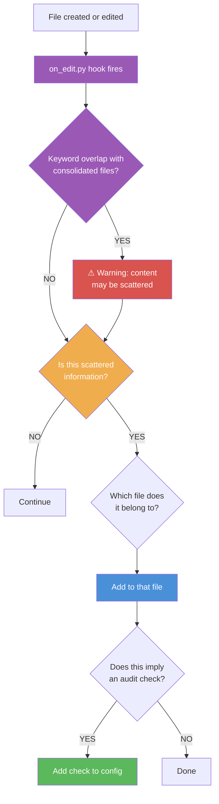

# Rule Zero: Every Edit Triggers Categorization

The single most important pattern for keeping a rule system organized
as it grows. Without it, rules scatter across files and become unfindable.

---

## The Problem

As you use the system, information accumulates in many places:

- Rules in conversation context (never saved)
- Learnings mentioned in chat (lost at session end)
- Fixes applied to code (the "why" is not captured)
- Decisions made verbally ("let's use pnpm from now on")

Without a routing mechanism, this information stays scattered — or worse,
gets lost entirely when a session ends.

## The Rule

Every time any file is created or edited, immediately ask:

> "Is this scattered information that belongs in a consolidated file?"



## Routing Table

When you identify scattered information, route it to the right place:

| Type of Information | Route To |
|--------------------|----------|
| Operational discovery / mistake | `rules/core-rules.md` or category-specific rules file |
| TODO or planned work | Backlog (JSON file or DB table) |
| "We chose X because Y" | A decision log or rules file with the "Why" section |
| New convention or standard | `rules/core-rules.md` |
| Configuration value (path, URL, version) | Rules file or config |
| A pattern that should be checked | `startup-config.yaml` checks section |

## Examples

### Example 1: Discovery During Coding

While fixing a bug, you discover the project uses a non-obvious pattern:

```
Discovery: "API error responses must use the ErrorResponse class,
not raw JSON objects. Three endpoints were using raw JSON and causing
inconsistent error handling on the frontend."
```

**Route:** Add to `rules/core-rules.md`:
```markdown
### error-response-format
All API error responses must use the ErrorResponse class from
src/utils/errors.py. Do not return raw JSON error objects.

- DO: raise ErrorResponse(400, "Invalid input")
- DON'T: return {"error": "Invalid input"}, 400

**Why:** Three endpoints used raw JSON, causing inconsistent error
handling on the frontend. ErrorResponse ensures consistent format.
```

**Then ask:** Does this imply a check?
```yaml
checks:
  - name: no-raw-error-json
    command: "grep -rn 'return.*{.*error.*}.*[0-9]' routes/ | wc -l | tr -d ' '"
    validator: "equals:0"
```

### Example 2: Decision Made in Conversation

User says: "Let's use SQLite for the cache instead of Redis — we don't need
the complexity and it simplifies deployment."

**Route:** Add to rules file:
```markdown
### cache-backend
Cache uses SQLite (via sqlite3 stdlib), not Redis. Decision made to
simplify deployment — single file, no external service needed.

**Why:** Redis adds operational complexity (separate process, connection
management, monitoring) that isn't justified for our cache size.
```

### Example 3: Learning from a Failure

The agent used the wrong database column name because the README was stale.

**Route:** Add to rules file:
```markdown
### schema-source-of-truth
The live schema is defined in migrations/. The README table
is outdated — do not trust column names from the README.
```

**Check:**
```yaml
checks:
  - name: readme-schema-warning
    command: "head -5 README.md | grep -c 'Schema table below may be outdated'"
    validator: "equals:1"
    fail_message: "README missing schema staleness warning"
    optional: true
```

## Applying Rule Zero to Your Agent

Add this to your agent instructions file:

```markdown
## Rule Zero

After every file edit, ask: "Is this scattered information that belongs
in a consolidated file?" If yes, route it immediately — don't wait.

Routing:
- Operational discovery → rules/core-rules.md
- TODO or planned work → backlog
- Decision with rationale → rules file with Why section
- Verifiable convention → startup-config.yaml checks
```

## Why "Rule Zero"

It's called Rule Zero because it fires BEFORE all other rules. It's the
meta-rule that makes the rule system self-maintaining. Without it, rules
accumulate in conversations and are lost. With it, every session makes
the system stronger.

**Structural enforcement:** Rule Zero is not just a behavioral pattern —
it is structurally enforced via the `on_edit.py` PostToolUse hook. After
every file write or edit, the hook scans the edited file for keyword
overlap with consolidated files. If it detects content that likely belongs
in a consolidated file, it emits a warning, prompting the agent to route
the information before moving on. This means scattered content is caught
at edit time, not during periodic reviews.

**Detection thresholds:** The hook skips files under 50 bytes (too small
to contain meaningful scattered content) and requires at least 3 keyword
matches before emitting a warning. This avoids false positives on files
that share only one or two generic terms with a consolidated file.

**Configuring consolidated files:** The hook reads its file list and
keywords from `startup-config.yaml` under `rule_zero.consolidated_files`:

```yaml
rule_zero:
  consolidated_files:
    - path: rules/core-rules.md
      keywords: [convention, pattern, rule, standard, decision]
    - path: MEMORY.md
      keywords: [project, state, context, session, workflow]
    - path: backlog.json
      keywords: [todo, task, backlog, planned, deferred]
```

Each entry maps a file path to the keywords that signal content belongs
there. When the hook finds >= 3 keyword matches between an edited file
and any consolidated file entry, it warns that the content may be scattered.

The system grows organically:
1. You work normally
2. `on_edit.py` fires on every file edit, scanning for scattered content
3. Rule Zero catches information as it appears
4. Routes it to the right file
5. The forward flow adds audit checks if needed
6. Next session, the information is loaded and enforced

No periodic "cleanup" sessions needed. No "let's organize our rules" meetings.
The system maintains itself through the routing mechanism, backed by
hook enforcement that makes the pattern hard to skip.
