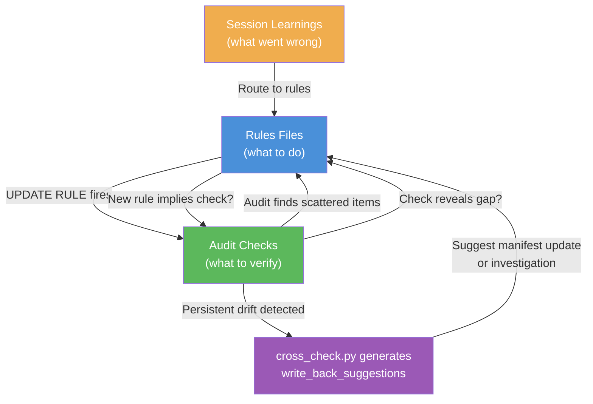
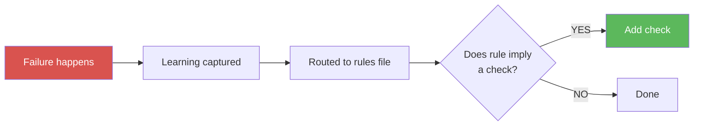

# Self-Healing Loop: Bidirectional Rule-Audit Feedback

A pattern where rules feed audit checks AND audit checks feed rules,
creating a system that grows organically from real usage.

---

## The Problem

Most rule systems are write-once:

1. Someone writes rules
2. Someone writes audit checks
3. Over time, new rules appear that no audit check covers
4. Over time, audit checks find issues that no rule addresses
5. The gap between "rules we have" and "rules we need" grows silently

## The Pattern

The self-healing loop connects three components. Drift detection is
structurally enforced via `cross_check.py`, which is the actual
enforcement mechanism: it runs a bounded 2-pass cycle (detect, fix,
re-check, log remaining), compares expected state from the manifest
against live checks, and generates concrete `write_back_suggestions`
for any persistent drift. This moves the pattern beyond detection-only
— the system actively proposes how to resolve drift.



### Forward Flow: Rule → Audit Check

Every time a rule is added or updated, ask:

> "Does this new rule imply something that should be verified automatically?"

If yes, add a check to your infrastructure checks or cross-check config.

**Examples:**

| New Rule | Implied Check |
|----------|--------------|
| "Use pnpm, not npm" | `grep -r "npm run" scripts/ \| grep -v pnpm \| wc -l` should be 0 |
| "All API endpoints require auth" | `grep -r "@public" routes/ \| wc -l` should be 0 |
| "Database migrations must be reversible" | Each migration file has both `up()` and `down()` |
| "No TODO comments in main branch" | `git diff main \| grep TODO \| wc -l` should be 0 |

### Backward Flow: Audit → Rule

When an audit check discovers something unexpected, ask:

> "Does this finding represent a pattern that should be a rule?"

If yes, add a rule to your rules file, then apply the forward flow
(does this new rule need a check?).

**Examples:**

| Audit Finding | New Rule |
|--------------|----------|
| "3 files still reference old API v2 path" | "After any path change, grep the full codebase for the old path" |
| "Config file has stale count (says 12, actually 15)" | "After adding items, update all references to the count" |
| "Two scripts import from deprecated module" | "Module X is deprecated, import from module Y instead" |

### The Learning Input

Session learnings (mistakes, surprises, operational discoveries) are the
third input. They get routed to rules, which trigger the forward flow:



## Implementation

### With YAML Config (Method A)

After editing `rules/core-rules.md`, check your `startup-config.yaml`:

```yaml
# Ask: does the new rule imply a verifiable check?
checks:
  - name: no-npm-usage           # Added because of "use pnpm" rule
    command: "grep -r 'npm run' scripts/ | grep -v pnpm | wc -l | tr -d ' '"
    validator: "equals:0"
    fail_message: "npm usage found — should be pnpm"
```

### With SQLite (Method B)

```sql
-- After adding a rule
INSERT INTO rules (name, content, category, tier)
VALUES ('use-pnpm', 'Use pnpm, not npm...', 'tooling', 1);

-- Ask: does this imply a check?
INSERT INTO checks (name, command, validator, fail_message)
VALUES ('no-npm-usage',
        'grep -r "npm run" scripts/ | grep -v pnpm | wc -l | tr -d '' ''',
        'equals:0',
        'npm usage found — should be pnpm');
```

### Infinite Loop Guard

Both directions MUST check "is this already there?" before adding:

- Before adding a rule: search existing rules for a similar entry
- Before adding a check: search existing checks for one that covers the same thing
- Never re-process items you just added in the same session

The rule is: act on NEW items only. If it's already captured, move on.

## When to Apply

Apply the self-healing check:

- After adding any rule → "Does this imply a check?"
- After any audit finding → "Does this imply a rule?"
- After any session learning → "Which rule file does this belong to?"
- After any file edit → "Is this scattered information that belongs in a consolidated file?"

The last question is RULE ZERO — see the [Rule Zero](rule-zero.md) pattern.

---

## The Enforcement Mechanism: `cross_check.py`

`cross_check.py` is the engine that makes the self-healing loop
operational. It runs once per session after Tier 1 loads and implements
a **bounded 2-pass design**:

1. **Pass 1 — Detect and auto-heal.** Compare every expected value in the
   manifest's `cross_check.expected_counts` against a live command result.
   Items marked `auto_heal: true` with a `heal_command` are fixed
   automatically.
2. **Pass 2 — Re-check healed items only.** Any healed item that still
   drifts is moved to the drifted list.
3. **Stop.** No further passes run. The sentinel is marked
   `cross_check_done: true` to prevent re-runs within the same session.

This bounded design prevents infinite correction loops — the system
gets exactly two chances to converge, then logs whatever remains.

### Write-Back Suggestions

When drift persists after both passes, `cross_check.py` (lines 116-133)
generates structured fix suggestions and stores them in the sentinel
file at `sentinel["write_back_suggestions"]`.

Two formats are used depending on whether the check had a heal command:

| Condition | Suggestion format |
|-----------|------------------|
| Check has a `heal_command` (auto-heal was attempted but source still drifted) | `SUGGESTED FIX for '<name>': update expected value in manifest (X -> Y), or fix the source.` |
| Check has no `heal_command` (manual-only item) | `UNRESOLVED DRIFT '<name>': expected X, got Y. Update manifest or investigate.` |

**What triggers suggestions:** Any item in the `drifted` list after
Pass 2 completes — meaning auto-heal either wasn't configured or
didn't resolve the mismatch.

**Where stored:** `sentinel["write_back_suggestions"]` — a JSON array
of suggestion strings written to the sentinel file in `$TMPDIR`.

**What happens next:** The agent reads the sentinel on subsequent
prompts. It can act on suggestions directly (e.g., updating the manifest
count) or flag them for human review if the drift source is unclear.
The suggestions are also printed to stdout during the hook run so they
appear in the session log.

### Standalone Audit Runner

The `audit.py` script provides on-demand execution of the check side of
the self-healing loop. While startup checks run automatically at session
start, the audit runner lets you verify infrastructure state at any point
during a session. It uses the same validator framework, so checks written
for startup work identically when run standalone. See the
[Audit Runner](audit-runner.md) reference for usage and configuration.
