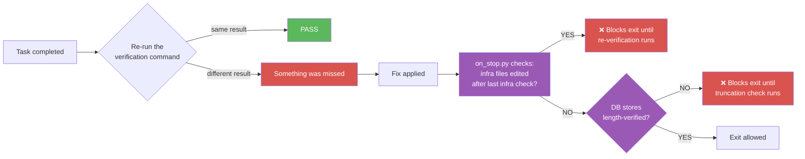

# Self-Verification: The 4-Point Check

A pattern for verifying that work is actually done — not just that the
agent said it's done. Apply after completing any task.

---

## The Problem

AI agents (and humans) confuse "I wrote the code" with "it works."
Generating output feels like completing the task. But:

- Writing a rule is not following it
- Writing a check is not running it
- Editing a file is not verifying the edit took effect
- Committing code is not confirming it was pushed

The gap between "I did it" and "it's done" is where most failures hide.

## The 4-Point Self-Check

After completing ANY task, run these 4 checks before declaring done:

### 1. "Did I actually do what I said I did?"

Re-read the file, re-run the query, re-check the output. Don't trust
the memory of doing it — VERIFY with a command.



**Wrong:**
```
"I updated the config file. Done."
```

**Right:**
```bash
# Verify the edit is actually there
grep "new_setting" config.yaml
# Output: new_setting: true  ← confirmed
```

### 2. "Is it in ALL the places it should be?"

If you updated a rule, is it in:
- The rules file?
- The backup copy (if you have one)?
- The version control system (committed + pushed)?

If you added a new file, is it:
- Referenced in the config?
- Listed in the documentation?
- Included in the backup/sync process?

### 3. "Did I miss anything related?"

Every change has ripple effects. Ask:

- If I added rule X, does rule X need a corresponding check?
- If I changed a path, are there other files referencing the old path?
- If I renamed a function, did I update all call sites?

```bash
# Example: after changing an API path
grep -r "old/api/path" src/ docs/ tests/
# Should return 0 results if all references updated
```

### 4. "Would a re-run produce the same result?"

Run the verification command AGAIN. Same output?

- **Same → PASS** — the change is stable
- **Different → INVESTIGATE** — something is non-deterministic or a
  race condition exists

## When to Apply

| After... | Self-check |
|----------|-----------|
| Editing a config file | `grep` for the new value to confirm it's there |
| Adding a rule | Check it appears in the rules file AND implies a check |
| Running a build | Check the output artifacts exist |
| Committing code | `git status` shows clean, `git log -1` shows your commit |
| Pushing to remote | `git log origin/main -1` matches local |
| Running tests | Check exit code AND output (exit codes lie) |
| Creating a file | Verify it exists AND has the expected content |
| Deleting a file | Verify it's gone AND no references remain |

## Integration with the Startup Architecture

### As an Infrastructure Check

Add self-verification as a startup check:

```yaml
checks:
  - name: last-commit-pushed
    command: "git log origin/main..HEAD --oneline | wc -l | tr -d ' '"
    validator: "equals:0"
    fail_message: "Unpushed commits exist"

  - name: no-stale-references
    command: "grep -r 'TODO:.*FIXME' src/ | wc -l | tr -d ' '"
    validator: "equals:0"
    fail_message: "Stale TODO/FIXME references found"
    optional: true
```

### As a Stop Hook Check (Structurally Enforced)

Self-verification is structurally enforced by the `on_stop.py` hook.
Before session exit, the hook checks whether any infrastructure files
were edited after the last infrastructure check ran. If fixes were
applied but verification was not re-run, the hook blocks exit (exit
code 2 — retry) until the agent re-runs verification. This prevents
the "I fixed it but didn't check if the fix worked" failure mode.

**Note:** `git commit` and `git push` are auto-allowed by the gate even
during the `tier1_pending` state. This means you can commit a fix
discovered during startup without waiting for all tier1 files to load —
version control is never blocked by the gate.

```yaml
stop:
  require_clean_repos: true     # Self-check #2: is it committed?
  require_transcript: false
  require_self_verification: true  # Block exit if infra files changed post-check
```

### As an Agent Instruction

Add to your agent instructions file:

```markdown
## Self-Verification

After completing ANY task, run at least one verification command that
proves the work is complete. Do NOT narrate what you did — RE-RUN the
checks.

The 4-point self-check:
1. "Did I actually do what I said I did?" → re-run the command
2. "Is it in all the places it should be?" → check backups, git, docs
3. "Did I miss anything related?" → grep for ripple effects
4. "Would a re-run produce the same result?" → run it again
```

### As a No-Truncation Enforcement (DB Mode)

When using the database data store, `on_stop.py` verifies that every
batch insert logged during the session has a corresponding length
verification entry. The hook queries `rule_log` for rows with
`event_type='db_store'` that lack a matching `event_type='db_store_verified'`
row. If unverified stores are found, exit is blocked until the agent
confirms the stored content matches the expected length (e.g., via
`SELECT length(column)`). This prevents silent truncation during batch
inserts — a failure mode where rules or checks appear to load but are
quietly clipped, leaving the agent running with incomplete data.

This is the 4th structural enforcement mechanism, alongside:
1. Infrastructure check (startup-time)
2. Stop hook re-verification (post-fix)
3. Agent instructions (behavioral)
4. No-truncation enforcement (DB integrity at exit)

## Key Insight

> "I did it" is not the same as "it's done."

Narrating completion without verifying is how agents declare PASS but
miss items. The self-verification pass catches what the main task missed —
because it RE-RUNS the checks instead of assuming they passed.
